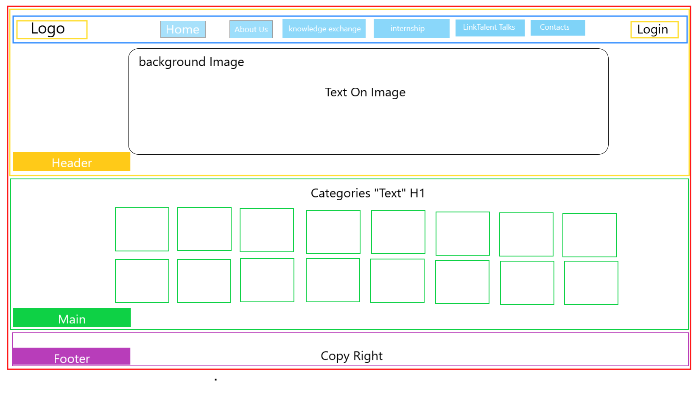
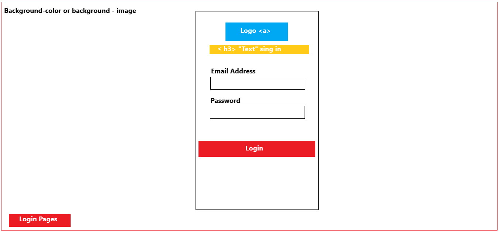
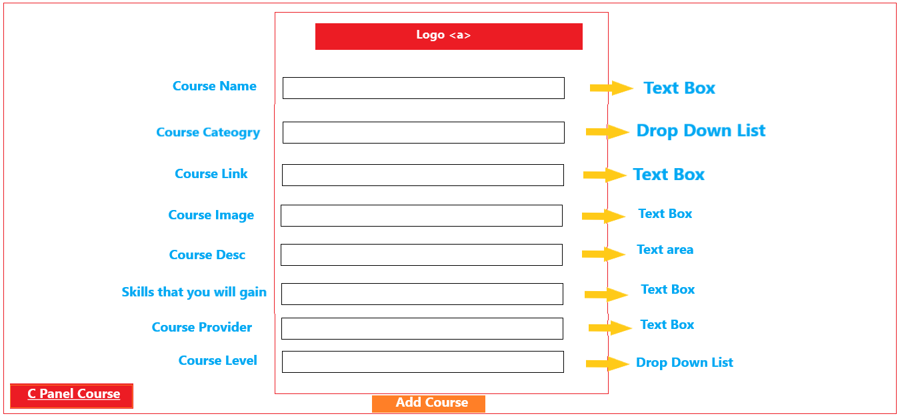
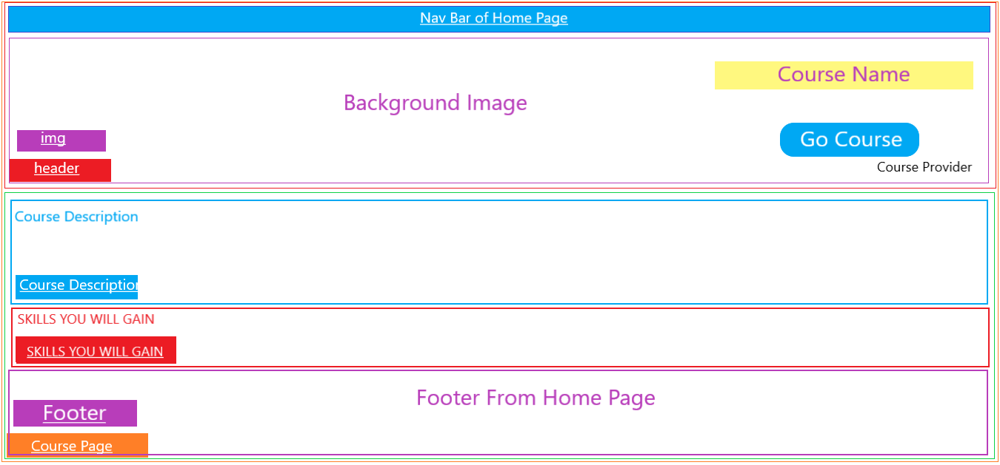
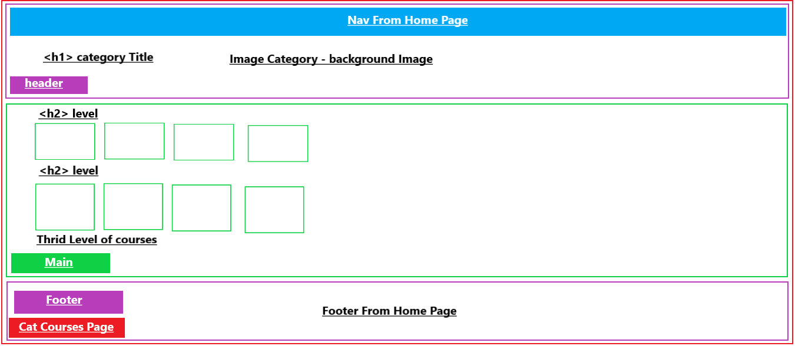

# LinkTalent Platform

## Project Description
On the LinkTalent Platform, you will find all of the available online study programs provided by a third-party organization. You can get personal support as well as recommendations on which lessons, tutorials Through Pair To Pair Mentoring Program, and language courses and Tools That you need to reach your goals.

## Team Members
- M Aghead Albalkhe
- Tamara Hussien
- Mais Abdalrazeq
- Yasmeen Tawileh
- Alaa Nasser Awad ALdous

## Wireframes

*  HomePage Wireframe

* Login Page Wireframe

* Admin Page Wireframe

* Course Page Wireframe

* Category Courses Page WireFrame

## Problem Domain 

Due to the Covid-19 many of youth get out of thier Education industry so,
we decided to build an education website for people who are interested in self-learning and update their skills continuously.  
Once you open the website you will find all the categories, each one containing a set of courses displayed depending on its level. 
Also, we like to offer  an internship training for users after they have finished the courses to get into parctical experince . In addition to the existence of our speakers and the ability to users to exchange their skills between themselves. 

## User Stories

> * As a user, I would like to see the courses arranged in categories.
    > - Create a constructor function that creates an object associated with each category has the following properties:

        - Category Name
        - Category image
        - Array That Contians category's Courses 
        - Category Render Funcation
        - Add Courses

    > - Create a constructor function that creates an object associated with each course has the following properties:

        - Course Name
        - Category Name
        - Course Link
        - Course image
        - Course Desc
        - Course Skills
        - Course Provider
        - Course Level
        - Course Render Funcation

> * As a user, I prefer to watch the description for each course and what I will gain from it. 
    > - In The course Page we will call Course Render Funcation .

> * As an Admin, I would like to Add Courses To categories.
    > - Create Object From Course  constructor. 
    > - In The Admin Page call The Add Course Function inside Category Constractor.

> * As a user, I prefer To provide an Internship opportunities To webiste visitors.
    > - Adding opportunity To Internship Page . 

> * As a user, I prefer To provide knowledge exchange opportunity between the users themselves.
    > -Adding opportunity To Internship Page . 

 > The Link Of The  Project Management Board   [Project Management Board](https://github.com/LinkTalent/LinkTalent/projects/1)
 
